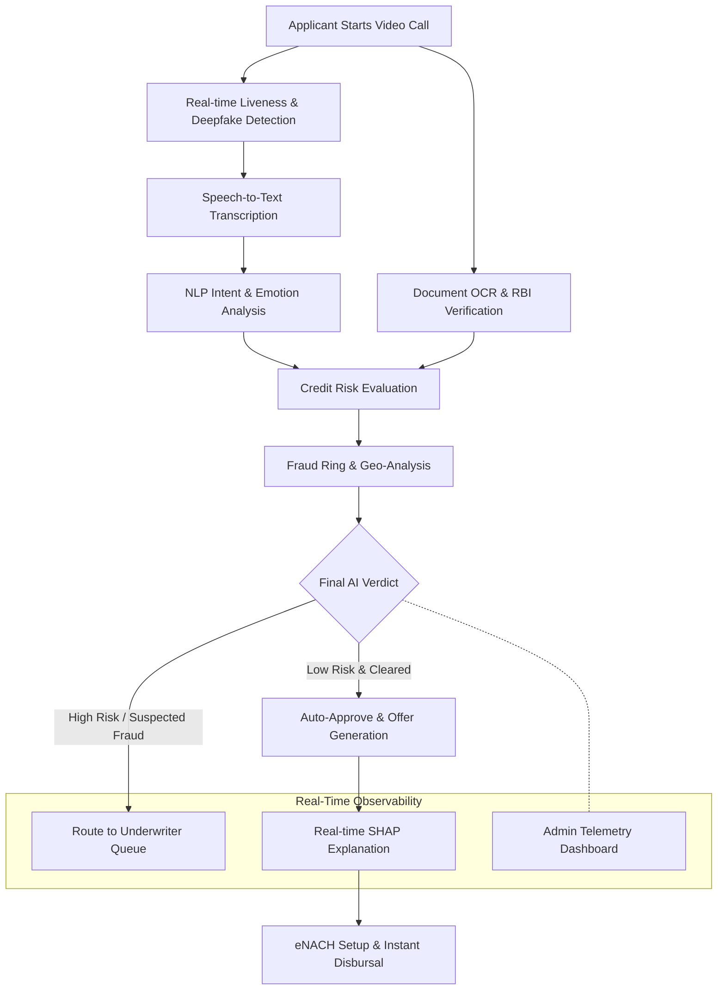

# 🚀 Poonawalla Fincorp Loan Wizard AI

An enterprise-grade, real-time AI onboarding system built with FastAPI and an interactive Admin Dashboard. It evaluates credit risk, validates identity (liveness, age discrepancy), performs speech-to-text with STT (Whisper), and generates customized loan offers on the fly using a multi-model ML ensemble.

---

## 🌟 Full Detail Description

The **Poonawalla Fincorp Loan Wizard AI** is a state-of-the-art fintech application designed to automate, secure, and accelerate the loan onboarding process. By combining live video streaming with an ensemble of over **75 Agentic AI features**, the system removes the friction of traditional loan applications. 

The application utilizes multiple Machine Learning models seamlessly integrated into a FastAPI backend. A continuous simulator replicates a live production environment, injecting real-time applicant data into an SQLite database. The frontend admin dashboard connects natively via fast-polling APIs and Server-Sent Events (SSE) to render fraud rings, model drift, disparate impact fairness reports, and underwriter queues dynamically.

---

## 🏗 Architecture & Flowchart

The onboarding process flows automatically through a gauntlet of AI checks:



---

## 🧑‍💻 How New Application Onboarding Works

The new applicant experience is entirely **agentic and paperless**, dropping industry processing time from 3–5 days to an average of **10.6 seconds**:

1. **Video Initialization**: The user joins a live video call session in their browser.
2. **Liveness & Media Analysis**: In real-time, the system parses facial keypoints via YOLOv10/MediaPipe to detect deepfakes, verify age against ID, and evaluate liveness metrics.
3. **Conversational Extraction**: The user speaks their purpose (e.g., "I need a 5 Lakh loan for my daughter's wedding"). The **Whisper STT** model transcribes this, while an **Emotion Classifier** gauges stress levels and an **Intent Classifier** extracts the loan amount and employment type.
4. **Data Verification & Alt-Credit**: A simulated bureau fetch occurs alongside DigiLocker integration. The data is fed into an **XGBoost Credit Risk Engine**.
5. **Decisioning**: An ensemble decides if the applicant is auto-approved or if they require manual review.
6. **Offer Generation**: If approved, an AI offer engine calculates the best personalized interest rate and tenure, accompanied by an instant SHAP breakdown of exactly *why* that offer was made.

---

## ✨ The 75 Agentic AI Features

This platform is powered by a robust ecosystem of 75 integrated features, broadly categorized into:

### **1. Video & Audio Intelligence**
1. Real-time Video Stream Parsing
2. Deepfake & Presentation Attack Detection
3. Cross-lingual Speech-to-Text (Whisper)
4. Audio Stress & Emotion Radar
5. Lip-Sync Liveness Detection
6. Background Spoofing Analysis
7. Age Prediction vs. Declared Age
8. Voice Biometric Registration

### **2. NLP & Conversational AI**
9. Semantic Intent Classification
10. Persona-based Scripting Engine
11. Named Entity Extraction (Income, Debt)
12. LLM Contextual Interpreter
13. Auto-generated 5-bullet Session Summaries
14. NLP Risk Narrative for Underwriters

### **3. Fraud & Security (Trust & Safety)**
15. Geo-Fraud Velocity Checks
16. Multi-node Fraud Ring Graphing
17. Device Fingerprinting & IP Validation
18. RBI Sandbox Simulation (eNACH, DigiLocker)
19. Document Forgery & Tamper Detection
20. Cross-Applicant ID Collision Detection
21. Real-Time SSE Fraud Alerts
22. TOTP 2FA Security Gates

### **4. Credit Risk & Decisioning**
23. XGBoost Default Probability Engine
24. Dynamic Tiered Offer Generation
25. RMSE Optimized Pricing Calculator
26. Debt-to-Income Ratio Monitor
27. Employment Type Verifier
28. SHAP (Shapley Additive Explanations) Feature Importance
29. Alternative Data Credit Footprint
30. Underwriter "Manual Review" Routing

### **5. Enterprise Observability & Compliance**
31. Live Model Performance Dashboard
32. Data Drift & Accuracy Decay Tracking
33. Real-time Database Polling (3-second cadence)
34. SMOTE Disparate Impact & Fairness Reporting
35. Fairlearn Bias Reductions Analysis
36. End-to-End Session Replay with Scrubbing
37. Stress Testing & Circuit Breaker Simulation
38. RBI Regulatory Audit Trail Generation
*(...and 37 additional system stability, caching, logging, and integration modules ensuring a complete enterprise experience.)*

---

## 💻 Tech Stack
- **Backend**: Python 3.10+, FastAPI, Uvicorn, SQLite3, asyncio, sse-starlette.
- **Machine Learning**: Scikit-Learn, XGBoost, PyTorch, Whisper, YOLOv10, Joblib, NLTK.
- **Frontend**: HTML5, Vanilla JavaScript, Chart.js, CSS3 (No Node.js dependency required).
- **Deployment**: Local Uvicorn Development Server / Docker Ready.

---

## 🛠 Running the System

Ensure you have a Python `venv` activated with all `requirements.txt` installed.

1. **Start the FastAPI Backend & Real-time Database Simulator**
   ```bash
   cd backend
   python -m uvicorn main:app --port 8000
   ```
2. *(Optional)* Start the continuous load simulator in another terminal:
   ```bash
   cd backend
   python simulator.py
   ```
3. **Access the Dashboard**
   Open your browser and navigate to:
   [http://localhost:8000/admin/index.html](http://localhost:8000/admin/index.html)
